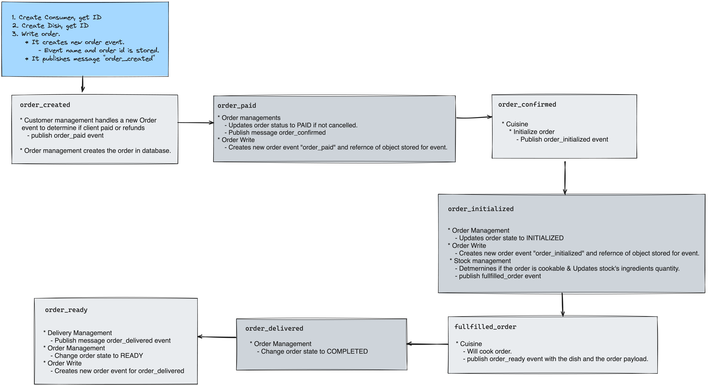

# Restaurant Microservices
This project is based on an academical project, with the objective to build a Restaurant Software using a microservices architecture.

The projetct has 6 microservices that comunicate with each other using a message broker (rabbitmq was the one chosen)

# Microservices
1. Order Write Management - Built with Node.js. Following the CQRS pattern, this project has the responsability receive the customer orders and to publish them to the broker so the work on other microservices can start.
2. Order Management - Built with Node.js. It has the responsability to manage the customer orders.
3. Customer Management - Built with Node.js. This project has the responsability to manage the customers.
4. Cuisine - Built with Node.js. This project has the responsability to manage the cuisine processes.
5. Stock Managament - Built with Node.js. This project has the responsability to manage the ingredients stock.
6. Delivery Manager - Built with python. This project has the responsability to manage the deliveries.

# Setup
1. Create a rabbitMq Instance and replace the ``AMQP_URL`` on all projects docker-compose files with the new amqp url
2. run ``docker-compose build`` for each project
3. spin up the services and databases for each project, the `--service-ports` is used to expose the ports.
    ```
    docker-compose run mongo
    ```
    ```
    docker-compose run --service-ports <service_name>
    ```

# Sample Workflow
For Creating succesfully a new order we can follow these steps:

1. Create a customer: POST `localhost:3001/customer` with the following data:

    ```
    {
        "name": "Andres P",
        "card_number": "123456",
        "address": "Nayon"
    }
    ```
2. Create a dish: POST `localhost:3002/dish` with the following data:

    ```
    {
        "name": "Ceviche",
        "ingredients": [
            {
                "code": "camaron",
                "quantity": 6
            },
            {
                "code": "limon",
                "quantity": 3
            }
        ]
    }
    ```
3. Create stock for the previous dish: POST `localhost:3003/stock` for the follwing data:

    ```
    {
        "ingredient_code": "camaron",
        "quantity": 10
    }
    ---
    {
        "ingredient_code": "limon",
        "quantity": 10
    }
    ```

4. Create a new Order, we need to make a POST request to `localhost:3004/order` with the following data:
    ```
    {
        "customer_id": "<your_customer_id>",
        "dish_id": "<your_dish_id>",
        "released_on": "2024-07-09",
        "type": 0
    }
    ```
Following steps above should trigger the following events:



# Exercies
In order to apply Event-Driven, Micro-services and APIs concepts you can work on this project and do some of these additional things.

* Replace some micro service.
* Create a new micro service that works with the others.
* Upgrade some microservice.
* Improve APIs endpoints validations.